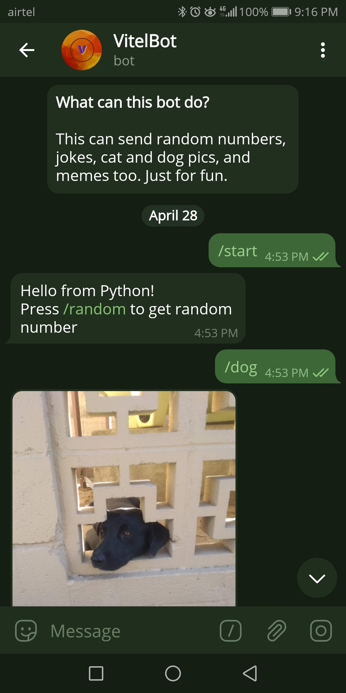
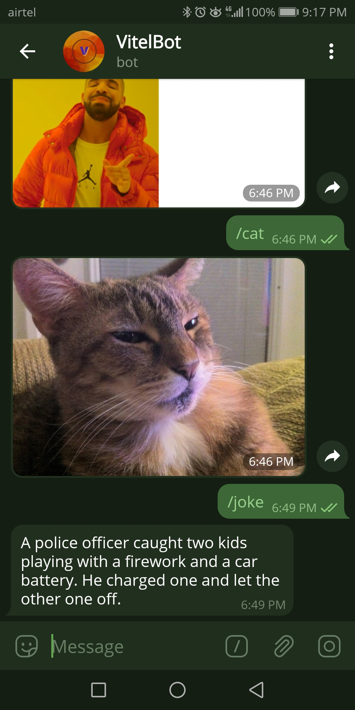

[]()
[](https://github.com/vijethph/VitelBot/issues)
[](https://github.com/vijethph/VitelBot/graphs/contributors)
[](https://github.com/vijethph/VitelBot/network)
[](https://github.com/vijethph/VitelBot/stargazers)
[](https://github.com/vijethph/VitelBot/blob/master/LICENSE)
[](https://www.python.org/)
[](https://hub.docker.com/r/vijethph/vitelbot)
[](https://heroku.com/deploy)

<br />
<p align="center">
  <a href="https://github.com/vijethph/VitelBot">
    
  </a>

  <h2 align="center">VitelBot</h2>

  <p align="center">
    A Telegram Bot made in Python, that can perform a variety of tasks, based on requests to certain APIs.
    <br />
    <br />
    <a href="https://github.com/vijethph/VitelBot/issues">Report Bug</a>
    ·
    <a href="https://github.com/vijethph/VitelBot/issues">Request Feature</a>
  </p>
</p>


<!-- TABLE OF CONTENTS -->
## Table of Contents

* [About the Project](#about-the-project)
  * [Built With](#built-with)
* [Getting Started](#getting-started)
  * [Prerequisites](#prerequisites)
  * [Installation](#installation)
* [Usage](#usage)
* [Contributing](#contributing)
* [License](#license)
* [Contact](#contact)
* [Acknowledgements](#acknowledgements)


<!-- ABOUT THE PROJECT -->
## About The Project

<center><a href="screenshot1.jpg"></a>
<a href="screenshot2.jpg"></a></center>

This is a Telegram Bot made with Python that uses [python-telegram-bot](https://python-telegram-bot.org) wrapper which can perform a variety of tasks, like getting a random number, a random joke, cat and dog pictures, and also memes. It can easily be accessed by Telegram Users by opening this link: [VitelBot](https://t.me/@VijethsTestingBot).


### Built With
This project is entirely built with the following components and languages:
* [Python](https://www.python.org)
* [python-telegram-bot wrapper](https://python-telegram-bot.org)

<!-- GETTING STARTED -->
## Getting Started

The Telegram Bot can easily be accessed by opening this link: https://t.me/VijethsTestingBot. Telegram Users can then send queries to the bot by issuing listed commands. In order to build this bot manually, and get a local copy of the Python program up and running follow these simple steps.

### Prerequisites

Telegram App must be installed for this interacting with this Bot. First, grab an API key for your Telegram Bot by following these steps:

1. Make sure you have an Telegram account. Start Telegram's BotFather Bot by opening this link: https://t.me/BotFather
2. Issue /newbot command. The BotFather bot asks you the bot's name, its picture and other details. Enter them according to your needs.
3. Finally BotFather issues an API key for the bot that you have created. **Store the API key securely, and don't share it with anyone.**


Next, to make the bot work, it needs to be programmed with this script. For that, Python>=3.7 and pip>=19.2 should be installed. After installation, check their versions using

```python
python --version
pip --version
```


### Installation

1. Clone the repo
```git
git clone https://github.com/vijethph/VitelBot.git
```
2. Open the downloaded folder
```sh
cd VitelBot
```
3. Install the packages listed in `requirements.txt` using the following command:
```python
pip install -r requirements.txt
```
4. Open `main.py`, replace TOKEN with your API key in single quotes, and MODE with 'dev', i.e.,
```python
TOKEN = 'your-API-key'
MODE = 'dev'
```
5. Finally run the program using
```python
python main.py
```
The Bot can now be used by issuing commands to it.

Another way to install this app is to use it's Docker Image, which is available at [DockerHub](https://hub.docker.com/r/vijethph/vitelbot). [Docker](https://www.docker.com/) should be installed in your system. Just run these commands to pull the image and start the container:
```
docker pull vijethph/vitelbot
docker run -p 8443:8443 -e TOKEN='yourapikey' -e MODE='dev' vijethph/vitelbot
```
Where `'yourapikey'` should be replaced with your API key (with single quotes).

If you wish to deploy the bot to Heroku (so that it stays online all the time), simply click `'Deploy to Heroku'` badge shown above. You need to have a Heroku account for doing this. Then, in Heroku Dashboard, go to App settings, add these Environment Variables:
```
key : TOKEN, value : your-API-key
key : MODE, value : prod
```

<!-- USAGE EXAMPLES -->
## Usage

When the bot is opened in Telegram, press Start. It will introduce itself. Users will see a list of commands that can be issued to the bot. All the commands begin with the prefix '/'. So press '/' to view the commands, and choose any one of them to get the required output.


<!-- CONTRIBUTING -->
## Contributing [](https://github.com/vijethph/VitelBot/pulls)


Contributions are what make the open source community such an amazing place to be learn, inspire, and create. Any contributions you make are **greatly appreciated**.

1. Fork the Project
2. Create your Feature Branch (`git checkout -b feature/AmazingFeature`)
3. Commit your Changes (`git commit -m 'Add some AmazingFeature'`)
4. Push to the Branch (`git push origin feature/AmazingFeature`)
5. Open a Pull Request


<!-- LICENSE -->
## License

Distributed under the GNU GPL License.


<!-- CONTACT -->
## Contact

Vijeth P H - [@vijethph](https://github.com/vijethph)

Project Link: [https://github.com/vijethph/VitelBot](https://github.com/vijethph/VitelBot)

## Thank You!

Made with ❤  in India.

If you like this project, please ⭐ this repo and share it with others 👍


<!-- ACKNOWLEDGEMENTS -->
## Acknowledgements
* [Python Docs](https://docs.python.org)
* [Img Shields](https://shields.io)
* [Choose an Open Source License](https://choosealicense.com)
* [python-telegram-bot Docs](https://python-telegram-bot.readthedocs.io/en/stable/)

